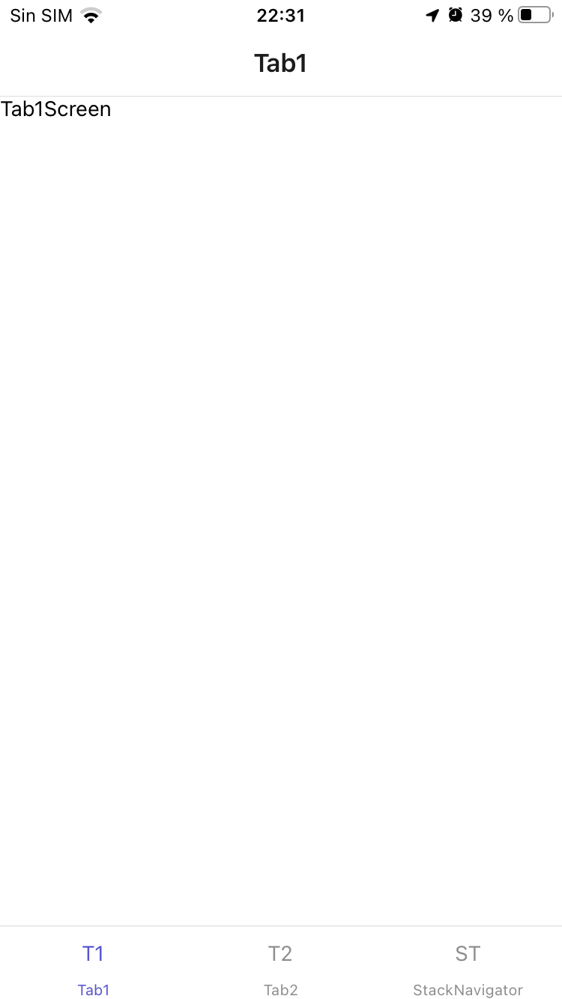
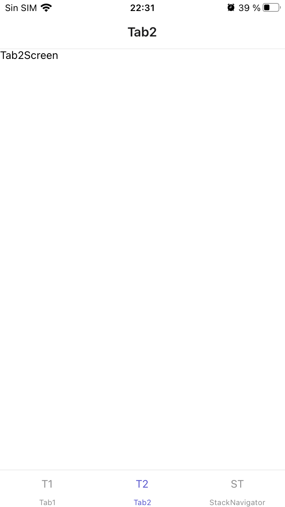
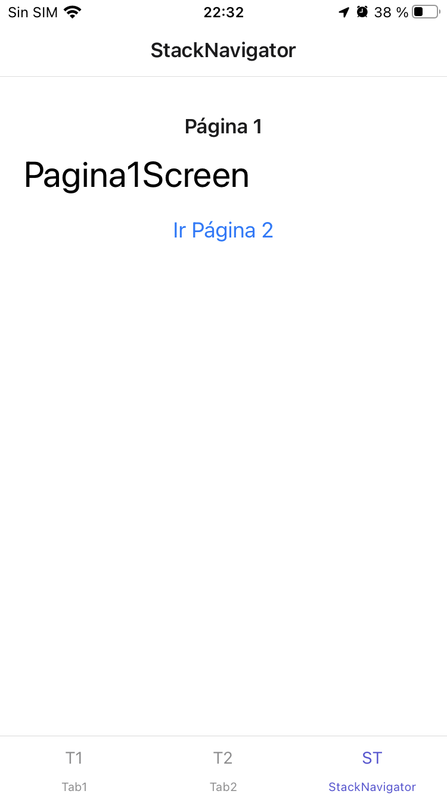
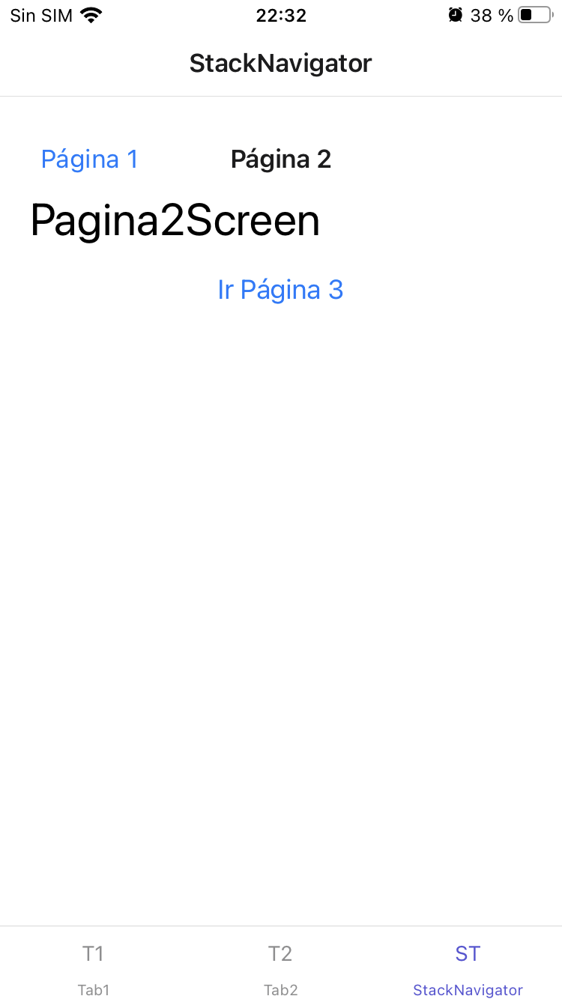
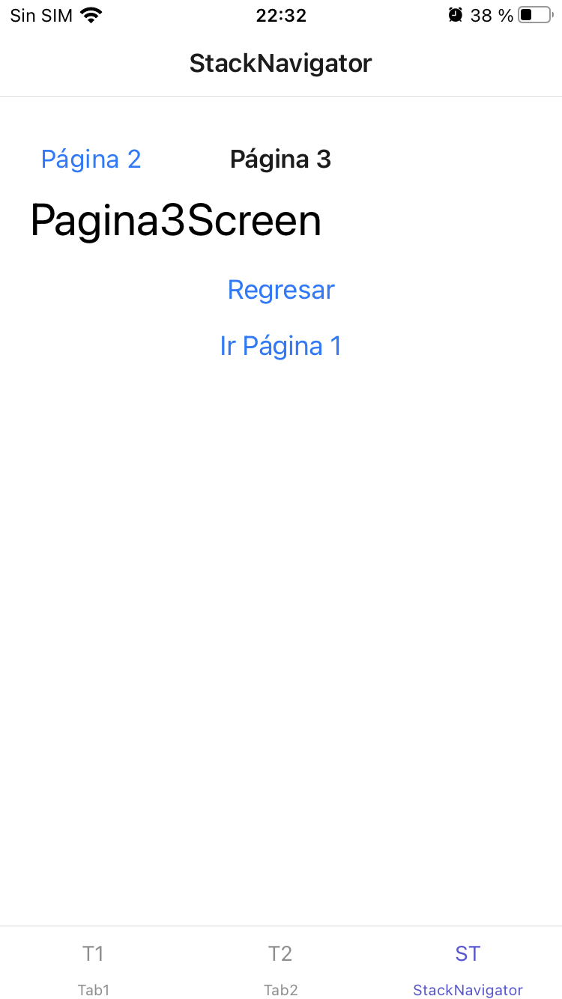

# Desarrollo de la Actividad 4 y 5

Nombre: Guillermo Echagüe


## Instalar Expo en Local

Primero instalamos con npm explo-cli y exp (debemos de tener Node.js y npm instalados)
```bash
npm install -g expo-cli exp
```


## Inicio de proyecto
```bash
expo init vistasApp
```

To run your project, navigate to the directory and run one of the following yarn commands.

```bash
- cd vistasApp
- yarn start # you can open iOS, Android, or web from here, or run them directly with the commands below.
- yarn android
- yarn ios # requires an iOS device or macOS for access to an iOS simulator
- yarn web
```

## Dependencias del proyecto
```bash
yarn add @react-navigation/native@^5.x

expo install react-native-gesture-handler react-native-reanimated react-native-screens react-native-safe-area-context @react-native-community/masked-view

yarn add @react-navigation/bottom-tabs

yarn add @react-navigation/material-bottom-tabs react-native-paper react-native-vector-icons
```

### Funciones de App


### Pantalla Tab1


### Pantalla Tab2


### Pantalla StackNavigation 1


### Pantalla StackNavigation 2


### Pantalla StackNavigation 3

